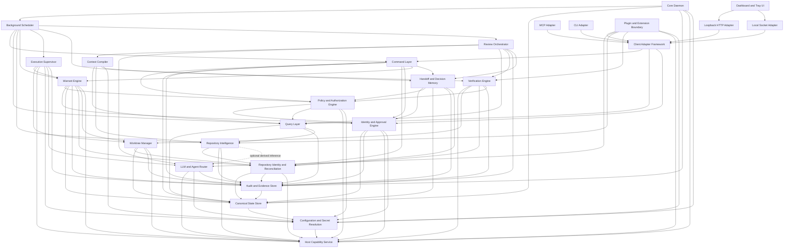

# Familiar Stable Subsystem Decomposition

**Status:** Architectural baseline  
**Date:** 2026-08-02

## Purpose and Scope

This document defines Familiar's stable subsystem boundaries before implementation PRDs are finalized. It decomposes the approved target architecture and ADRs into responsibilities, authority, state ownership, trust boundaries, and allowed dependencies.

A subsystem is a logical architectural boundary, not necessarily a Rust crate, process, service, database, or deployable unit. Multiple subsystems may share a crate or process when their dependency direction and authority boundaries remain enforceable. Conversely, host or security constraints may justify separating part of a subsystem later. Packaging does not change the ownership rules in this document.

This document introduces no capabilities beyond the approved philosophy, target state, roadmap, delivery backlog, ADR-001, ADR-002, and ADR-003.

## System-Wide Boundary Rules

- Repository source and Git history are authoritative for source-code state.
- Transactional canonical state is authoritative for current Familiar operational state.
- Audit events are authoritative evidence for defined material actions; they are not an event-sourcing stream and do not reconstruct all current state.
- The daemon is the sole mutable authority and canonical writer.
- All governed mutations enter through protocol-neutral daemon-owned command handlers.
- Queries are protocol-neutral, read-only, project-scoped, and side-effect free with respect to canonical state.
- Client adapters translate protocols; they do not own domain policy, canonical status, or workflow rules.
- Derived intelligence, caches, indexes, summaries, and projections are disposable accelerators and never canonical truth.
- Approval is distinct from authorization; authorization is distinct from execution authority; execution authority is conveyed only by warrants for governed work.
- The Warrant Engine owns execution authority. The Execution Supervisor owns process execution and cannot create or broaden authority.
- Verification, review, finding disposition, acceptance, and warrant completion are distinct decisions.
- The warrant state machine contains execution semantics only and never becomes a general workflow engine.
- Cross-project access is denied unless a separately authorized, explicit cross-project operation is introduced by approved architecture. No such operation is defined here.
- Plugins and background workers are untrusted callers of explicit contracts, never alternate authority paths.

## Subsystems

### 1. Core Daemon

- **Purpose:** Provide the long-lived, local composition root and sole mutable authority for Familiar.
- **Responsibilities:** Own process lifecycle, single-writer election and epoch, subsystem composition, health, backpressure, graceful shutdown, recovery coordination, and availability of shared core services.
- **Explicit non-responsibilities:** It does not implement protocol-specific behavior, domain policy, repository analysis, agent reasoning, or direct SQL business operations in the composition root.
- **Owned canonical state:** Daemon installation identity, writer epoch, lifecycle and health facts that are canonical, and recovery coordination state. Domain state remains owned semantically by its domain subsystem.
- **Owned derived state:** In-memory service registry, connection pools, task handles, queue depth, transient health samples, and disposable runtime caches.
- **Commands accepted:** Start, stop, health-state transition, enter or leave governed maintenance, and initiate recovery. External domain commands enter through the Command Layer.
- **Queries exposed:** Daemon identity, writer epoch, service health, readiness, backpressure, and shutdown status.
- **Events or evidence emitted:** Startup, shutdown, writer acquisition, recovery start and outcome, degraded service, backpressure, and unclean termination evidence.
- **Dependencies:** Canonical State Store, Audit and Evidence Store, Background Scheduler, Host Capability Service, and Configuration and Secret Resolution; it composes all other in-process subsystems without taking over their rules.
- **Allowed callers:** Operating-system service manager, authorized local administrative client through an adapter, and internal recovery bootstrap.
- **Trust boundary:** It is the local authority boundary. Possessing a process handle, PID file, or socket path does not establish authorization.
- **Failure behavior:** Fail closed for mutation when single-writer ownership, canonical storage, audit atomicity, or required security services are unavailable; expose truthful degraded status for read-only operation where safe.
- **Recovery behavior:** Acquire a new writer epoch, fence stale workers and leases, validate storage consistency, invoke subsystem reconciliation, and resume scheduling only after mandatory checks pass.
- **Architectural invariants:** Exactly one canonical writer; no interface-specific domain logic; no LLM dependency for core operation; health reports observed state rather than aspiration.

### 2. Command Layer

- **Purpose:** Provide the single protocol-neutral entry boundary for governed canonical mutations.
- **Responsibilities:** Validate command schemas, authenticate caller context, assign or validate stable request IDs, enforce idempotency, invoke authorization and domain handlers, establish transaction boundaries, and atomically persist canonical changes with required audit events.
- **Explicit non-responsibilities:** It does not render protocol responses, run arbitrary processes, answer read models, own domain policy, or permit direct repository mutations outside governed execution.
- **Owned canonical state:** Command request and idempotency records, command outcomes, and causal linkage required by ADR-001.
- **Owned derived state:** Handler registry, validation metadata, short-lived request context, and metrics.
- **Commands accepted:** All canonical mutation commands, including project reconciliation, identity and approval transitions, warrant transitions, task and memory changes, evidence registration, findings disposition, and administrative repair.
- **Queries exposed:** Request outcome by stable request ID and command-schema metadata; domain reads go through the Query Layer.
- **Events or evidence emitted:** Accepted, denied, failed, interrupted, ambiguous, and completed command evidence with actor, interface, project, task, authority, versions, outcome, and causality.
- **Dependencies:** Policy and Authorization Engine, applicable domain subsystem, Canonical State Store, and Audit and Evidence Store.
- **Allowed callers:** Thin adapters, Background Scheduler, and trusted internal workers submitting results through authenticated internal caller contexts.
- **Trust boundary:** All input is untrusted regardless of local origin. Handler invocation is the mutation boundary; public mutation-capable repository APIs are prohibited outside it.
- **Failure behavior:** Reject malformed, unauthorized, stale-version, conflicting-idempotency, or out-of-scope commands. Roll back the entire SQLite transaction if canonical state and required audit evidence cannot both commit.
- **Recovery behavior:** Return the recorded result for an identical retry; reject request-ID reuse with changed content; surface ambiguous external outcomes for reconciliation rather than infer success.
- **Architectural invariants:** Every governed mutation crosses this layer; commands are protocol-neutral; canonical update and material audit event are atomic; repair and migration commands receive no bypass.

### 3. Query Layer

- **Purpose:** Provide shared protocol-neutral, project-scoped read access to canonical and explicitly labeled derived state.
- **Responsibilities:** Validate query schemas, authenticate and authorize read scope, compose stable read models, expose provenance and freshness, paginate bounded results, and report unavailable or unknown state truthfully.
- **Explicit non-responsibilities:** It does not mutate state, trigger implicit refresh, infer approvals, perform execution, hide uncertainty, or make cached presentation state authoritative.
- **Owned canonical state:** None.
- **Owned derived state:** Disposable read models, pagination tokens, and short-lived query caches keyed by canonical versions and project identity.
- **Commands accepted:** None.
- **Queries exposed:** Project and daemon status, tasks, decisions, findings, approvals, warrants, verification, reviews, handoffs, audit references, repository intelligence, context manifests, and execution evidence within authorized scope.
- **Events or evidence emitted:** Optional non-material access telemetry and security-denial evidence when required by policy; ordinary reads are not automatically material actions.
- **Dependencies:** Canonical State Store, Audit and Evidence Store, Repository Intelligence, and relevant domain query contracts.
- **Allowed callers:** Client adapters, Dashboard and Tray UI through adapters, Background Scheduler, Context Compiler, Review Orchestrator, and other core services with explicit project scope.
- **Trust boundary:** Query access is authorized and project-isolated. Derived and canonical fields must be distinguishable in every response.
- **Failure behavior:** Return explicit unavailable, stale, partial, or unauthorized results; never substitute empty lists or guessed status for storage or subsystem errors.
- **Recovery behavior:** Rebuild caches from canonical state and reconstructible derived indexes; resume pagination only when its version constraints remain valid.
- **Architectural invariants:** Read-only semantics; no hidden mutations; no cross-project leakage; no direct database access by callers; source and provenance links remain visible.

### 4. Canonical State Store

- **Purpose:** Provide transactional persistence for current Familiar operational state under daemon single-writer ownership.
- **Responsibilities:** SQLite transactions, referential integrity, optimistic versions, schema compatibility, project isolation, backup and restore consistency, and durable query support.
- **Explicit non-responsibilities:** It does not decide authorization, interpret domain transitions, execute processes, treat audit events as projections, or own repository source truth.
- **Owned canonical state:** Physical persistence of projects, tasks, identities, approvals, decisions, findings, verification records, handoffs, warrants, leases, checkpoints, command idempotency, effect records, and references to evidence and derived artifacts.
- **Owned derived state:** SQLite indexes, query plans, connection metadata, and rebuildable database statistics.
- **Commands accepted:** Transactional operations only from daemon-owned command handlers and governed migration or repair handlers; these are internal persistence calls, not public domain commands.
- **Queries exposed:** Typed persistence queries to the Query Layer and domain services within an authenticated daemon context.
- **Events or evidence emitted:** Storage health, integrity-check, migration, backup, restore, constraint-failure, and corruption evidence.
- **Dependencies:** Local SQLite and Configuration and Secret Resolution for approved locations and durability settings.
- **Allowed callers:** Command Layer within transactions, Query Layer for reads, and governed recovery or consistency checking. No adapter, plugin, UI, agent, or external tool.
- **Trust boundary:** The database file is sensitive canonical state. Filesystem access to it is not an authorized mutation interface.
- **Failure behavior:** Fail closed on write ambiguity, constraint failure, incompatible schema, lost writer ownership, or inability to atomically include required audit evidence.
- **Recovery behavior:** Use SQLite recovery and integrity checks, governed migrations, consistency reconciliation, and atomic restoration of canonical state with audit and referenced evidence.
- **Architectural invariants:** Transactional tables are authoritative for current operational state; one writer; foreign keys and project scope enforced; no public raw mutation API; no fabricated history.

### 5. Audit and Evidence Store

- **Purpose:** Preserve authoritative evidence for material actions and reproducible artifacts without becoming current-state authority.
- **Responsibilities:** Append-oriented audit-event persistence, evidence metadata and lineage, content-addressed artifact references, retention enforcement, causal ordering, integrity checks, and coordinated backup and restore.
- **Explicit non-responsibilities:** It does not reconstruct canonical state, authorize actions, decide outcomes, accept work, or replace source, Git, or transactional tables.
- **Owned canonical state:** Audit event records, evidence manifests and references, external-effect intent/attempt/observed-outcome/compensation records, retention holds, and historical-boundary markers.
- **Owned derived state:** Search indexes, compressed or cached renderings, checksums, and disposable evidence projections.
- **Commands accepted:** Append material-action evidence within a canonical transaction; register immutable evidence; apply governed retention holds; record reconciliation and restore results.
- **Queries exposed:** Audit timelines, causal chains, evidence manifests, integrity status, and referenced logs, diffs, test outputs, and effect records.
- **Events or evidence emitted:** Its own integrity, retention, missing-reference, duplicate, impossible-relationship, backup, restore, and consistency-check evidence.
- **Dependencies:** Canonical State Store for atomic metadata transactions, repository or approved local artifact storage for retained blobs, and Configuration and Secret Resolution for storage policy.
- **Allowed callers:** Command Layer, Query Layer, Verification Engine, Execution Supervisor, Review Orchestrator, and governed consistency or recovery services through explicit contracts.
- **Trust boundary:** Evidence may contain source, logs, secrets, personal data, and external-effect details. Access is project-scoped and retention-aware.
- **Failure behavior:** Block material canonical mutations when required audit evidence cannot commit; report missing or corrupt referenced artifacts without inventing substitutes.
- **Recovery behavior:** Restore canonical state, audit history, and referenced evidence as one consistency boundary; reconcile references and retain historical gaps explicitly.
- **Architectural invariants:** Append-oriented does not mean event sourced; audit evidence is immutable except governed redaction or retention metadata; referenced evidence cannot be removed while canonically required.

### 6. Repository Identity and Reconciliation

- **Purpose:** Establish stable project and file identity and reconcile observed repository lifecycle with canonical project state.
- **Responsibilities:** Repository discovery, canonical root and Git identity, repository-relative path normalization, containment checks, file create/change/delete/rename reconciliation, branch and worktree identity, complete scan tracking, and mismatch reporting.
- **Explicit non-responsibilities:** It does not summarize source, infer architecture, execute Git mutations for implementation, manage task worktrees, or make filesystem observations authoritative over Git and source.
- **Owned canonical state:** Stable project identity, canonical repository root binding, file identity and lifecycle records, scan and reconciliation status, branch/worktree references needed for identity, and explicit unresolved conflicts.
- **Owned derived state:** Filesystem watch state, debounce queues, scan cursors, transient stat caches, and candidate rename correlations.
- **Commands accepted:** Register or rebind project, reconcile repository, record file lifecycle, resolve identity conflict, and acknowledge a complete scan through the Command Layer.
- **Queries exposed:** Project resolution, canonical path mapping, file identity, repository and revision identity, reconciliation health, and scan completeness.
- **Events or evidence emitted:** Repository discovered, identity changed, file added/changed/deleted/renamed, scan completed or incomplete, containment violation, and reconciliation discrepancy evidence.
- **Dependencies:** Host Capability Service, Canonical State Store, Audit and Evidence Store, Git and repository source.
- **Allowed callers:** Command Layer, Repository Intelligence, Worktree Manager, Query Layer, and Background Scheduler.
- **Trust boundary:** Repository contents, paths, symlinks, Git configuration, hooks, and watcher events are untrusted observations requiring canonicalization and containment.
- **Failure behavior:** Mark state incomplete or conflicted; do not silently drop events, retain stale records as current, cross symlink boundaries, or guess rename identity.
- **Recovery behavior:** Perform deterministic full reconciliation against Git and filesystem state, resume bounded scans, and record deletions or uncertainty explicitly.
- **Architectural invariants:** Canonical paths are repository-relative; absolute host paths are runtime locations; source and Git are authoritative; all records are project-scoped.

### 7. Repository Intelligence

- **Purpose:** Produce reconstructible, provenance-bearing knowledge about repository content.
- **Responsibilities:** Content-hashed inventory, deterministic extraction, symbols and dependency metadata, file/module/subsystem summaries, lexical retrieval, derived-artifact provenance, invalidation, and optional semantic acceleration when approved.
- **Explicit non-responsibilities:** It does not own source truth, canonical decisions, task status, approvals, policy, execution, or acceptance.
- **Owned canonical state:** Only metadata that governs derived artifacts—artifact identity, provenance, generator/configuration identity, invalidation relationships, and references. Derived content itself is not canonical truth.
- **Owned derived state:** Hash caches, summaries, indexes, dependency graphs, lexical or optional semantic indexes, rankings, and analysis caches.
- **Commands accepted:** Index or invalidate identified content, reconcile artifact lineage, and register derived artifact metadata through governed handlers.
- **Queries exposed:** File inventory, symbols, dependencies, validated summaries, artifact provenance and freshness, lexical search, and optional semantic candidates.
- **Events or evidence emitted:** Artifact generated, reused, invalidated, stale, failed, source-conflicted, or rebuilt, with content and configuration hashes.
- **Dependencies:** Repository Identity and Reconciliation, repository source and Git, Audit and Evidence Store, Host Capability Service, and optionally LLM and Agent Router for explicitly derived model artifacts.
- **Allowed callers:** Context Compiler, Query Layer, Review Orchestrator, Verification Engine, and Background Scheduler.
- **Trust boundary:** All generated intelligence is untrusted until its provenance and input identity validate. Model output is particularly non-authoritative.
- **Failure behavior:** Mark artifacts unavailable or stale and fall back to source inspection; never return uncertain intelligence as canonical fact.
- **Recovery behavior:** Recompute from source, hashes, deterministic configuration, and provenance; discard corrupt or orphaned indexes.
- **Architectural invariants:** Content-addressed and project-isolated; derived state is rebuildable; uncertainty causes source access; optional semantic infrastructure can be removed without knowledge loss.

### 8. Context Compiler

- **Purpose:** Build reproducible, task-specific, budgeted context packages for agents and reviewers.
- **Responsibilities:** Resolve task scope and revision, select authoritative and derived evidence, include applicable decisions and constraints, enforce section and total token budgets, record omissions and provenance, and produce immutable context manifests with agent-neutral content.
- **Explicit non-responsibilities:** It does not accumulate conversation state as truth, authorize work, select acceptance outcomes, mutate source, or let model-specific rendering change underlying evidence.
- **Owned canonical state:** Context manifest identity, inputs, budgets, omissions, provenance references, recipient capability profile, and artifact references where retained as canonical task evidence.
- **Owned derived state:** Rendered context packages, token estimates, rankings, truncations, and provider-specific presentations.
- **Commands accepted:** Compile or invalidate a context manifest through the Command Layer when canonical registration is required.
- **Queries exposed:** Manifest metadata, reproducibility inputs, budget use, omissions, evidence inventory, and rendered variants.
- **Events or evidence emitted:** Compilation, cache reuse, source fallback, truncation, omission, provenance conflict, privacy denial, and rendering-equivalence evidence.
- **Dependencies:** Query Layer, Repository Intelligence, Handoff and Decision Memory, Configuration and Secret Resolution, and token-counting utilities.
- **Allowed callers:** LLM and Agent Router, Review Orchestrator, Background Scheduler, Query Layer, and authorized adapters.
- **Trust boundary:** Context may disclose source or secrets to an external model. Project isolation, privacy policy, recipient capability, and explicit budget govern release.
- **Failure behavior:** Fail closed on project ambiguity, invalid provenance, privacy violation, missing mandatory constraints, or inability to meet hard budgets; use authoritative source fallback where permitted.
- **Recovery behavior:** Recompile from immutable manifest inputs and canonical records; never rely on a vanished conversation or provider cache.
- **Architectural invariants:** Context is intentionally constructed, immutable by input identity, project-scoped, provenance-bearing, budgeted, and equivalent across agent-specific renderings.

### 9. Policy and Authorization Engine

- **Purpose:** Deterministically decide whether a principal may perform a requested operation in current canonical state.
- **Responsibilities:** Resolve applicable policy and invariants, evaluate identity, role, approval, delegation, warrant, project, task, host, effect, and risk gates, explain decisions, and fail closed on missing authority.
- **Explicit non-responsibilities:** It does not authenticate credentials, create human approval, issue warrants directly, execute work, invoke an LLM for authoritative decisions, or mutate policy outside commands.
- **Owned canonical state:** Versioned policy definitions, project policy bindings, invariant declarations, authorization-decision records, and explicit waiver or risk-acceptance references.
- **Owned derived state:** Compiled policy rules, decision caches keyed by all canonical inputs, and explanation renderings.
- **Commands accepted:** Register or supersede policy, bind policy to project, and record governed waiver or risk acceptance through the Command Layer.
- **Queries exposed:** Applicable policy, required gates, authorization decision and rationale, policy version, and unsatisfied conditions.
- **Events or evidence emitted:** Allow, deny, indeterminate, policy conflict, waiver, and invalidation evidence with exact inputs.
- **Dependencies:** Identity and Approval Engine, Query Layer or typed canonical read contracts, Host Capability Service, and Configuration and Secret Resolution.
- **Allowed callers:** Command Layer, Warrant Engine, Execution Supervisor at mandatory boundaries, Verification Engine for policy gates, and Background Scheduler for admission checks.
- **Trust boundary:** Policy inputs from repository, configuration, plugins, humans, or organizations are untrusted until canonically approved and scoped.
- **Failure behavior:** Deny on missing, stale, conflicting, unavailable, or ambiguous required state; never ask an LLM to resolve authority.
- **Recovery behavior:** Recompile from canonical policy and invalidate cached decisions when any input version changes.
- **Architectural invariants:** Deterministic and inspectable; current state always governs; authorization never implies human approval or execution; decisions are project-scoped and attributable.

### 10. Identity and Approval Engine

- **Purpose:** Own typed principal identity, replaceable authentication bindings, explicit human approval, and delegation semantics.
- **Responsibilities:** Principal lifecycle, credential-binding metadata, approval subject canonicalization, approval presentation evidence, signing where practical, approval lifecycle, revocation, supersession, expiration, and non-amplifying delegation.
- **Explicit non-responsibilities:** It does not issue execution authority, execute work, infer human consent, make signatures authoritative, or allow non-human principals to satisfy human approval.
- **Owned canonical state:** Principals and types, authentication bindings, roles and memberships, approval records and lifecycle, signatures and presentation references, delegations, and revocation/supersession relationships.
- **Owned derived state:** Canonical renderings, signature-validation caches, effective-approval views, and membership caches with explicit freshness.
- **Commands accepted:** Enroll, bind, rotate, revoke, approve, deny, supersede, expire, delegate, and revoke delegation through the Command Layer.
- **Queries exposed:** Principal identity and type, binding status, approval evidence and effectiveness inputs, delegation lineage, role eligibility, and lifecycle history.
- **Events or evidence emitted:** Identity enrollment/change, authentication binding use, approval presentation/decision/use/denial, signature validation, expiration, revocation, supersession, and delegation evidence.
- **Dependencies:** Canonical State Store, Audit and Evidence Store, Configuration and Secret Resolution, and Host Capability Service for local identity or key facilities.
- **Allowed callers:** Command Layer, Policy and Authorization Engine, Warrant Engine, Query Layer, and thin adapters for presentation and authentication transport.
- **Trust boundary:** Credentials, signing keys, external identity claims, UI renderings, and caller assertions are untrusted until verified. Signatures prove integrity, not authority.
- **Failure behavior:** Fail closed on identity ambiguity, invalid binding, subject mismatch, unavailable revocation state, unauthorized signer, or presentation/evidence mismatch.
- **Recovery behavior:** Restore identities and approvals with evidence as one boundary, revalidate bindings and signatures, and never fabricate approval for legacy data.
- **Architectural invariants:** Stable opaque IDs; typed principals; only eligible humans satisfy human gates; authentication, approval, delegation, authorization, and execution remain distinct; service accounts never originate human approval.

### 11. Warrant Engine

- **Purpose:** Own the canonical execution-authority state machine for governed work.
- **Responsibilities:** Derive immutable maximum capability envelopes from authorization, issue warrants, enforce lifecycle transitions, consumption, leases, checkpoints, expiration, revocation, supersession, ambiguity, and completion semantics.
- **Explicit non-responsibilities:** It does not execute processes, approve work, define task workflow, perform verification, conduct review, accept results, or broaden authority in place.
- **Owned canonical state:** Warrants, immutable authority bindings, state and versions, remaining budgets, lease records, checkpoint decisions, consumption, revocation, expiration, supersession, completion, and ambiguity relationships.
- **Owned derived state:** Effective-authority views, transition availability, deadline queues, and operator explanations derived from canonical state.
- **Commands accepted:** Issue, activate, lease, renew, reach checkpoint, continue, suspend, mark ambiguous, reconcile, consume, expire, revoke, supersede, fail, cancel, and complete through the Command Layer.
- **Queries exposed:** Maximum and effective authority, current state, transition eligibility, active lease, remaining budgets, checkpoints, terminal reason, and source approvals and authorization.
- **Events or evidence emitted:** Every material transition, lease action, checkpoint outcome, denial, stale-version attempt, scope violation, ambiguity, and terminal outcome.
- **Dependencies:** Policy and Authorization Engine, Identity and Approval Engine, Canonical State Store, Audit and Evidence Store, Repository Identity and Reconciliation, Worktree Manager, and Host Capability Service.
- **Allowed callers:** Command Layer for transitions; Execution Supervisor and Background Scheduler for queries and transition requests; Query Layer for reads.
- **Trust boundary:** Executor claims, lease possession, clocks, process liveness, and client-supplied scope are untrusted. Only current daemon state conveys authority.
- **Failure behavior:** Fail closed; invalidate or withhold leases on ambiguity, stale state, missing dependencies, or violated scope; never guess execution outcome.
- **Recovery behavior:** Fence prior writer epochs and stale leases, reconcile attempts and effects, and resume only through authorized transitions. Terminal warrants never reactivate.
- **Architectural invariants:** Only warrants convey governed execution authority; immutable maximum scope; expansion requires a successor; checkpoints are authorization boundaries; completion never means acceptance; the state machine is not a workflow engine.

### 12. Execution Supervisor

- **Purpose:** Run and observe processes under authority supplied by the Warrant Engine.
- **Responsibilities:** Admit only valid leases, spawn and contain processes, enforce command/tool/network/resource limits, track children, capture output, honor cancellation and stop conditions, submit checkpoint evidence, and produce terminal execution handoffs.
- **Explicit non-responsibilities:** It does not issue or transition warrants directly, decide approval or authorization policy, manage canonical task workflow, verify its own success, review work, or accept results.
- **Owned canonical state:** Execution-attempt and process-outcome records are semantically owned here but persisted only through Command Layer handlers; it owns no direct storage path.
- **Owned derived state:** Live process handles, stream buffers, resource counters, sandbox handles, and ephemeral executor connections.
- **Commands accepted:** Start attempt under lease, signal or cancel process, collect checkpoint, and terminate attempt; canonical consequences are requested through the Command Layer.
- **Queries exposed:** Live attempt status, process tree, resource use, output availability, enforcement health, and safe-stop capability.
- **Events or evidence emitted:** Spawn, command, output, resource use, timeout, cancellation, scope violation, interruption, exit, orphan detection, and checkpoint evidence.
- **Dependencies:** Warrant Engine for authority queries, Worktree Manager, Host Capability Service, Configuration and Secret Resolution, LLM and Agent Router, and Audit and Evidence Store for evidence submission contracts.
- **Allowed callers:** Background Scheduler and authorized daemon orchestration. Adapters may request execution only through commands, never call the supervisor directly.
- **Trust boundary:** Agents, commands, tools, subprocesses, repository scripts, model output, and environment are untrusted executable input.
- **Failure behavior:** Stop or suspend at the earliest safe boundary, fence further work, preserve worktree and evidence, and request an appropriate warrant transition. Never continue without a lease.
- **Recovery behavior:** Report observed process and worktree facts, terminate or fence stale processes, and defer outcome classification to governed warrant recovery and reconciliation.
- **Architectural invariants:** Process execution and execution authority remain separate; no warrant bypass; no direct canonical writes; external effects require explicit authority and evidence.

### 13. Worktree Manager

- **Purpose:** Safely create, identify, inspect, preserve, and retire isolated task worktrees.
- **Responsibilities:** Bind worktrees to task and base revision, prevent collisions, validate Git identity and containment, track dirty state, preserve recovery data, and perform governed retirement.
- **Explicit non-responsibilities:** It does not select tasks, grant execution authority, edit implementation files, approve deletion, run agents, merge results, or infer that a worktree is disposable.
- **Owned canonical state:** Worktree identity, project and task binding, base revision, lifecycle, approved location, preservation status, and retirement evidence references.
- **Owned derived state:** Git worktree-list observations, filesystem existence and cleanliness, locks, and transient path mappings.
- **Commands accepted:** Create, register, inspect-and-record, preserve, mark conflicted, and retire through the Command Layer with destructive-target validation.
- **Queries exposed:** Worktree identity, binding, revision, cleanliness, lifecycle, containment, and recovery status.
- **Events or evidence emitted:** Creation, collision, drift, dirty state, missing worktree, preservation, retirement, deletion target, and Git command evidence.
- **Dependencies:** Repository Identity and Reconciliation, Host Capability Service, Git, Canonical State Store, and Audit and Evidence Store.
- **Allowed callers:** Warrant Engine, Execution Supervisor, Verification Engine, Background Scheduler, Query Layer, and Command Layer.
- **Trust boundary:** Filesystem paths, symlinks, Git metadata, worktree registrations, and deletion targets are untrusted until explicitly resolved and validated.
- **Failure behavior:** Preserve uncertain or dirty worktrees, reject destructive operations on ambiguous targets, and mark lifecycle status truthfully.
- **Recovery behavior:** Reconcile canonical records with Git plumbing and filesystem observations; never recreate, remove, or rebind uncertain worktrees implicitly.
- **Architectural invariants:** One stable task/base binding; repository-relative content identity; explicit rollback/preservation; no destructive action without governed authority and exact target validation.

### 14. Verification Engine

- **Purpose:** Produce deterministic, reproducible evidence about repository and execution outcomes.
- **Responsibilities:** Resolve declared and discovered checks, run bounded verification commands, inspect exact diffs and changed paths, parse logs, check cleanliness and invariants, retain evidence, and report satisfied, failed, missing, or ambiguous requirements.
- **Explicit non-responsibilities:** It does not modify implementation state, fix failures, issue warrants, review subjective quality, waive findings, or accept work.
- **Owned canonical state:** Verification policies, test and verification-result records, requirement satisfaction links, invariant-check outcomes, and evidence references.
- **Owned derived state:** Discovered command candidates, parsers, normalized output, caches, and report renderings.
- **Commands accepted:** Register verification policy, request governed verification, record result, and invalidate stale result through the Command Layer.
- **Queries exposed:** Required checks, exact commands and environments, results, evidence, revision coverage, missing checks, and invariant status.
- **Events or evidence emitted:** Start, command, output, timeout, cancellation, pass, fail, missing, scope violation, stale result, and reproducibility evidence.
- **Dependencies:** Host Capability Service, Worktree Manager, Repository Identity and Reconciliation, Audit and Evidence Store, Policy and Authorization Engine, and warrants where verification execution itself is governed.
- **Allowed callers:** Background Scheduler, Warrant Engine at checkpoint gates, Review Orchestrator, Query Layer, and authorized commands.
- **Trust boundary:** Test code, scripts, logs, generated files, exit codes, and tool output are untrusted observations; commands execute within host and warrant policy.
- **Failure behavior:** Preserve explicit failure or unavailable status; never translate missing, crashed, timed-out, unparsable, or partial verification into success.
- **Recovery behavior:** Re-run only against identified source and environment when authorized; retain interrupted evidence; invalidate results when revision or relevant environment changes.
- **Architectural invariants:** Deterministic evidence precedes claims; verification cannot mutate implementation state; passing tests alone do not imply acceptance; exact revision and environment are retained.

### 15. Review Orchestrator

- **Purpose:** Coordinate independent, adversarial review distinct from implementation and deterministic verification.
- **Responsibilities:** Assign an eligible independent reviewer, compile falsification-oriented context, invoke review, ingest attributable findings, preserve disagreement, and request governed finding disposition.
- **Explicit non-responsibilities:** It does not implement changes, deterministically verify them, dismiss its own findings, decide acceptance, manufacture consensus, or let one model perform and validate the same role where separation is required.
- **Owned canonical state:** Review assignments, reviewer identity and independence evidence, review attempts, findings and evidence references, and review completion status.
- **Owned derived state:** Reviewer candidate rankings, prompts, rendered review contexts, deduplication candidates, and summaries labeled as derived.
- **Commands accepted:** Create assignment, start or end review attempt, ingest finding, record reviewer unavailable, and submit disposition request through the Command Layer.
- **Queries exposed:** Review requirements, assignments, independence, findings, disagreement, evidence, and completion status.
- **Events or evidence emitted:** Assignment, context delivery, reviewer invocation, finding, conflict, unavailable reviewer, incomplete review, and completion evidence.
- **Dependencies:** Context Compiler, LLM and Agent Router, Query Layer, Verification Engine, Audit and Evidence Store, and Handoff and Decision Memory.
- **Allowed callers:** Background Scheduler, authorized humans through adapters, and Query Layer.
- **Trust boundary:** Reviewer output is untrusted reasoning and cannot override deterministic evidence or human authority. Provider identity alone does not prove independence.
- **Failure behavior:** Preserve partial findings and explicit unavailability; require human-only review or stop according to policy rather than self-review silently.
- **Recovery behavior:** Resume or create a new attributable review attempt using the same immutable evidence manifest; never overwrite prior disagreement.
- **Architectural invariants:** Implementer and reviewer roles are independent where practical; review never accepts its own findings; consensus is not proof; acceptance remains separate.

### 16. LLM and Agent Router

- **Purpose:** Select and invoke replaceable models and coding agents through vendor-neutral capability contracts.
- **Responsibilities:** Maintain capability and health metadata, route task and review contracts, enforce provider/model constraints and budgets, manage fallback, and normalize attributable results.
- **Explicit non-responsibilities:** It does not own canonical workflow state, authorize actions, issue warrants, approve or accept work, persist project truth, or make provider sessions canonical identities.
- **Owned canonical state:** Only durable agent capability profiles, configured provider references, assignment provenance, and health metadata explicitly required for decisions; canonical task state belongs elsewhere.
- **Owned derived state:** Live provider connections, availability probes, routing scores, response buffers, model-specific renderings, and ephemeral session IDs.
- **Commands accepted:** Register or disable an adapter/provider profile and record governed assignment metadata through the Command Layer. Invocation is an internal bounded operation, not a canonical mutation API.
- **Queries exposed:** Available capabilities, constraints, health freshness, selection explanation, and provider-neutral contract support.
- **Events or evidence emitted:** Selection, invocation, model/provider identity, token and cost use, fallback, timeout, refusal, malformed result, and unavailability evidence.
- **Dependencies:** Configuration and Secret Resolution, Host Capability Service, Client Adapter Framework for agent contracts where applicable, and Audit and Evidence Store. Callers pass immutable compiled context artifacts; the router does not call back into the Context Compiler.
- **Allowed callers:** Execution Supervisor, Review Orchestrator, Repository Intelligence for optional derived summaries, and Background Scheduler.
- **Trust boundary:** Providers, models, agent processes, remote APIs, and their output are untrusted and potentially unavailable or data-exfiltrating.
- **Failure behavior:** Degrade to another explicitly permitted provider or return unavailable; never broaden warrant or privacy scope to obtain a result.
- **Recovery behavior:** Reconnect or create a new attributable attempt; do not treat provider conversation state as durable project memory.
- **Architectural invariants:** Agent and model neutral; deterministic core functions without an LLM; routing state never becomes canonical workflow truth; provider loss does not corrupt workflow state.

### 17. Handoff and Decision Memory

- **Purpose:** Preserve durable engineering knowledge, decisions, findings context, and worker-to-worker handoffs across sessions and agents.
- **Responsibilities:** Manage decision lifecycle and rationale, typed memory with provenance, task outcomes, structured handoffs, supersession, source revision links, and human-approved versus proposed knowledge.
- **Explicit non-responsibilities:** It does not treat conversation summaries as truth, approve architecture automatically, execute work, resolve findings by itself, or replace source inspection.
- **Owned canonical state:** Decisions, rationale, status, approvers, supersession, project invariants, structured handoffs, accepted memory, implementation history references, and related evidence links.
- **Owned derived state:** Session rollups, summaries, retrieval rankings, presentation views, and proposed memory pending governance.
- **Commands accepted:** Propose, approve, reject, supersede, or retire a decision; record typed memory; create or acknowledge handoff; and attach evidence through the Command Layer.
- **Queries exposed:** Applicable decisions and invariants, handoffs, historical rationale, known failure modes, provenance, status, and source revision.
- **Events or evidence emitted:** Proposal, approval, rejection, supersession, handoff creation/acknowledgment, provenance conflict, and stale-memory evidence.
- **Dependencies:** Identity and Approval Engine, Policy and Authorization Engine, Canonical State Store, Audit and Evidence Store, and Repository Identity and Reconciliation.
- **Allowed callers:** Context Compiler, Review Orchestrator, Query Layer, Background Scheduler, and authorized adapters through commands.
- **Trust boundary:** Agent-generated memory and summaries are proposed, not approved truth. Cross-project and cross-revision reuse requires explicit scope and provenance.
- **Failure behavior:** Preserve uncertainty and conflicting records; never silently overwrite rationale or elevate proposed knowledge.
- **Recovery behavior:** Rebuild derived retrieval from canonical records and evidence; retain superseded history and mark unavailable references.
- **Architectural invariants:** Conversations are transient; knowledge is typed and durable; humans own architecture; source uncertainty triggers source inspection; handoffs are structured records.

### 18. Background Scheduler

- **Purpose:** Trigger bounded recurring and deferred work without creating an alternate authority path.
- **Responsibilities:** Schedule repository scans, invalidation, context preparation, verification, review, warrant expiry, lease checks, retention, reconciliation, and health work according to canonical policy and backpressure.
- **Explicit non-responsibilities:** It does not mutate canonical state directly, authorize itself, bypass warrants, execute arbitrary commands, own task workflow truth, or infer success from job completion.
- **Owned canonical state:** Scheduled-job definitions, next-run or deadline records where durability is required, attempt status, and backoff state persisted through commands.
- **Owned derived state:** In-memory timers, queues, worker availability, transient retries, and load metrics.
- **Commands accepted:** Register, suspend, resume, or cancel a schedule through the Command Layer; internal timer firing is not authority.
- **Queries exposed:** Scheduled work, deadlines, queue depth, backoff, last attempt, and blocked reasons.
- **Events or evidence emitted:** Due, dispatched, deferred, skipped, backpressured, failed, interrupted, and completed job-attempt evidence.
- **Dependencies:** Query Layer, Command Layer, and explicit worker service contracts including Repository Intelligence, Warrant Engine, Execution Supervisor, Verification Engine, and Review Orchestrator.
- **Allowed callers:** Core Daemon and authorized administrative commands.
- **Trust boundary:** Time and job readiness do not confer authority. Every state change or governed execution is revalidated at dispatch.
- **Failure behavior:** Defer or fail closed, retain bounded queues, expose degraded state, and never flood workers or silently drop required work.
- **Recovery behavior:** Reload durable schedules and deadlines, deduplicate by stable job and request IDs, reconcile interrupted attempts, and reauthorize before redispatch.
- **Architectural invariants:** Background workers use command handlers; no timer bypasses policy or warrants; scheduling is not canonical task workflow; every job has bounds and a stopping point.

### 19. Host Capability Service

- **Purpose:** Discover, report, and mediate host-specific capabilities consistently across macOS and Linux.
- **Responsibilities:** Detect Git, filesystem, process, sandbox, key-store, network-control, service-manager, resource-limit, and platform features; expose capability evidence; provide narrow host operations to supervisors.
- **Explicit non-responsibilities:** It does not grant authority, choose policy, claim unavailable isolation, store secrets, execute arbitrary caller-supplied operations, or hide platform differences.
- **Owned canonical state:** Versioned host identity and capability observations when used by authorization or evidence, plus approved capability-policy bindings owned jointly with policy.
- **Owned derived state:** Live probes, tool locations, OS details, resource observations, and health caches.
- **Commands accepted:** Refresh capability inventory and record governed host enrollment or capability acknowledgment through the Command Layer.
- **Queries exposed:** Capability availability, enforcement strength, versions, limitations, freshness, and platform-specific operation support.
- **Events or evidence emitted:** Capability discovered, changed, unavailable, degraded, probe failed, enforcement violated, and host identity changed.
- **Dependencies:** Operating system, Git, and process and filesystem APIs. Bootstrap probe parameters are passed as values rather than resolved through a reverse dependency on Configuration and Secret Resolution.
- **Allowed callers:** Core Daemon, Policy and Authorization Engine, Warrant Engine, Execution Supervisor, Worktree Manager, Verification Engine, Identity and Approval Engine, and Background Scheduler.
- **Trust boundary:** Host tools, OS reports, PATH, environment, and subprocesses are not inherently trustworthy; exact binaries and observed enforcement require evidence.
- **Failure behavior:** Report capability unavailable or weaker than required and cause dependent authorization to fail closed; never simulate protection in status.
- **Recovery behavior:** Re-probe after restart or host change, invalidate decisions dependent on changed capabilities, and reconcile active work before continuation.
- **Architectural invariants:** Truthful capability reporting; macOS and Linux differences are explicit; policy decides adequacy; deterministic mechanisms precede model judgment.

### 20. Configuration and Secret Resolution

- **Purpose:** Resolve layered non-secret configuration and protected secret references without making configuration an authority bypass.
- **Responsibilities:** Load defaults, files, environment, project policy references, and runtime overrides with explicit precedence; resolve secrets at point of use; validate scope; redact output; and report provenance.
- **Explicit non-responsibilities:** It does not authorize operations, treat environment variables as canonical approval, expose raw secrets to adapters or models, or silently mutate canonical policy.
- **Owned canonical state:** Approved configuration references, project configuration versions, non-secret policy-relevant settings, and secret-reference metadata—not secret values unless an approved local secure store requires it.
- **Owned derived state:** Effective configuration snapshots, resolved secret handles, redacted views, and change detection.
- **Commands accepted:** Register, validate, supersede, or revoke configuration and secret references through the Command Layer.
- **Queries exposed:** Redacted effective configuration, provenance, validation, required missing values, and secret availability without disclosure.
- **Events or evidence emitted:** Configuration loaded, overridden, invalid, changed, secret resolved, unavailable, denied, or disclosed to an authorized boundary.
- **Dependencies:** Host Capability Service for platform paths and secret facilities, canonical state for approved references, and local configuration sources.
- **Allowed callers:** Core services requiring scoped configuration; adapters receive redacted query results only.
- **Trust boundary:** Configuration files, environment variables, provider endpoints, and secret sources are untrusted inputs. Secret values must not enter logs, context, audit payloads, or UI accidentally.
- **Failure behavior:** Fail closed for operations requiring missing or invalid secrets or security settings; preserve non-dependent local functionality.
- **Recovery behavior:** Re-resolve replaceable bindings and handles, invalidate dependent sessions on rotation, and never infer lost secret values from evidence.
- **Architectural invariants:** Secrets are least-privilege and point-of-use; configuration provenance is explicit; policy-relevant changes use commands and audit; local-first operation remains available.

### 21. Client Adapter Framework

- **Purpose:** Provide common thin-adapter contracts for protocol translation, authentication context, schema validation, errors, streaming, and conformance.
- **Responsibilities:** Map protocol requests to protocol-neutral commands and queries, attach actor/interface/project/request context, normalize errors, enforce transport limits, and provide parity and conformance behavior.
- **Explicit non-responsibilities:** It does not contain domain policy, mutate storage, own status, cache canonical truth, construct warrants, approve actions, or reinterpret command outcomes.
- **Owned canonical state:** Interface registration and capability metadata only where canonically required; no domain state.
- **Owned derived state:** Connections, sessions, transport buffers, negotiated protocol capabilities, and presentation caches.
- **Commands accepted:** Adapter registration or administrative enable/disable through the Command Layer; client payloads are forwarded as core commands.
- **Queries exposed:** Adapter capabilities, protocol versions, health, and translated core query surfaces.
- **Events or evidence emitted:** Connection, authentication context, request mapping, schema rejection, transport failure, rate limit, and disconnection evidence where material.
- **Dependencies:** Command Layer, Query Layer, Identity and Approval Engine for authentication context, and Configuration and Secret Resolution.
- **Allowed callers:** MCP, CLI, Local Socket, and Loopback HTTP adapters; approved future adapters and Plugin Boundary implementations.
- **Trust boundary:** Every client and serialized payload is untrusted. Transport authentication is not authorization or approval.
- **Failure behavior:** Reject invalid or unsupported requests without fallback to direct storage; preserve protocol correctness and avoid leaking secrets or cross-project state.
- **Recovery behavior:** Reconnect and replay only idempotent commands by stable request ID; reconstruct presentation state from queries.
- **Architectural invariants:** Thin, protocol-neutral core semantics; parity across interfaces; adapters remain independently replaceable and disableable.

### 22. MCP Adapter

- **Purpose:** Expose Familiar tools and resources to coding agents through MCP as a thin adapter.
- **Responsibilities:** MCP initialization, framing, schema validation, tool and resource mapping, project context resolution, streaming or cancellation mapping, and protocol-safe output.
- **Explicit non-responsibilities:** It does not open canonical storage, own an inference router or status truth, implement search or packing rules, mutate memory directly, or authorize agent activity.
- **Owned canonical state:** None beyond optional interface registration through the framework.
- **Owned derived state:** MCP connection state, negotiated capabilities, request correlation, and bounded transport buffers.
- **Commands accepted:** MCP tool calls mapped one-to-one to Command Layer contracts where mutating; no MCP-specific domain commands.
- **Queries exposed:** MCP tools and resources mapped to Query Layer contracts and immutable context artifacts.
- **Events or evidence emitted:** Connection, client identity, mapped request, cancellation, protocol error, and transport outcome evidence.
- **Dependencies:** Client Adapter Framework only, plus protocol libraries.
- **Allowed callers:** Authenticated or locally admitted MCP clients such as Claude Code, Codex, Cursor, OpenCode, and future agents.
- **Trust boundary:** Agent input and client-declared roots or identities are untrusted; stdout or equivalent protocol channels remain free of unrelated output.
- **Failure behavior:** Return protocol errors, fail closed on ambiguous project or authority, and never fall back to a local database.
- **Recovery behavior:** Reconnect, requery canonical state, and retry only idempotent requests with their original request IDs.
- **Architectural invariants:** Thin adapter; agent-neutral core schemas; agents cannot approve; no independent runtime authority.

### 23. CLI Adapter

- **Purpose:** Provide scriptable human and automation access to shared commands, queries, diagnostics, and evidence.
- **Responsibilities:** Parse arguments, establish authenticated caller and project context, render deterministic machine or human output, map exit codes, and preserve stable request IDs for retries.
- **Explicit non-responsibilities:** It does not implement business rules, edit the database, infer approval from interactivity, execute governed work directly, or report guessed daemon status.
- **Owned canonical state:** None.
- **Owned derived state:** Local invocation context, formatting preferences, and transient output.
- **Commands accepted:** CLI verbs mapped directly to Command Layer contracts.
- **Queries exposed:** CLI read operations mapped directly to Query Layer contracts.
- **Events or evidence emitted:** Interface identity, command or query correlation, authentication use, local validation error, and transport outcome evidence.
- **Dependencies:** Client Adapter Framework and Local Socket Adapter client transport; loopback HTTP may be an explicitly supported fallback without semantic differences.
- **Allowed callers:** Humans and authorized local automation.
- **Trust boundary:** Shell input, current directory, environment, files, and automation identity are untrusted and never imply approval.
- **Failure behavior:** Nonzero deterministic exit, explicit unavailable or denied state, and no direct-mode database fallback.
- **Recovery behavior:** Reconnect and use stable request IDs for idempotent retry; obtain all status from canonical queries.
- **Architectural invariants:** Scriptable and thin; protocol-neutral semantics; no alternate daemonless mutation mode.

### 24. Local Socket Adapter

- **Purpose:** Provide the primary authenticated, low-latency local IPC transport to shared core services.
- **Responsibilities:** Socket lifecycle, local peer authentication, framing, backpressure, request correlation, streaming, cancellation, and connection health.
- **Explicit non-responsibilities:** It does not own commands, queries, policy, status, retries beyond transport semantics, or canonical state.
- **Owned canonical state:** None beyond optional interface identity and endpoint registration.
- **Owned derived state:** Socket handles, peer sessions, stream cursors, buffers, and connection metrics.
- **Commands accepted:** Framed Client Adapter Framework command messages.
- **Queries exposed:** Framed Client Adapter Framework queries and authorized event streams.
- **Events or evidence emitted:** Bind, peer authentication, connect, disconnect, malformed frame, backpressure, cancellation, and transport failure evidence.
- **Dependencies:** Client Adapter Framework, Host Capability Service, and Configuration and Secret Resolution for endpoint and local authentication.
- **Allowed callers:** CLI, approved local adapters, dashboard or tray backend, plugins through approved proxies, and local agent integrations.
- **Trust boundary:** Local processes and filesystem access to a socket path are not automatically trusted; peer identity and permissions are verified.
- **Failure behavior:** Reject unauthenticated peers, bound message sizes, apply backpressure, and close malformed or policy-violating sessions without affecting core state.
- **Recovery behavior:** Rebind safely after verifying endpoint ownership, reject stale endpoint confusion, and let clients reconstruct state through queries.
- **Architectural invariants:** Primary local IPC; transport-only; no embedded domain logic; no direct storage access.

### 25. Loopback HTTP Adapter

- **Purpose:** Provide loopback HTTP, streaming, and browser-compatible access to the same core services.
- **Responsibilities:** Bind safely to loopback by default, authenticate local clients, implement HTTP framing and streaming, enforce origin and request limits, serve adapter endpoints, and map core errors and versions.
- **Explicit non-responsibilities:** It does not own dashboard truth, expose unauthenticated non-loopback service, implement policy, mutate storage, or create HTTP-specific workflow semantics.
- **Owned canonical state:** None beyond optional interface registration.
- **Owned derived state:** Connections, sessions, CSRF or local-auth material, stream buffers, and HTTP metrics.
- **Commands accepted:** HTTP requests mapped through Client Adapter Framework to core commands.
- **Queries exposed:** HTTP endpoints and streams mapped to Query Layer contracts.
- **Events or evidence emitted:** Bind address, authentication, origin rejection, request correlation, rate limit, stream interruption, and transport outcome evidence.
- **Dependencies:** Client Adapter Framework, Host Capability Service, and Configuration and Secret Resolution.
- **Allowed callers:** Dashboard and Tray UI, approved loopback integrations, and authorized local clients.
- **Trust boundary:** Browsers, origins, local web content, and every HTTP request are untrusted. Non-loopback binding requires separately approved authentication and threat-model architecture.
- **Failure behavior:** Fail closed on authentication, origin, bind, or project ambiguity; never silently expose beyond loopback or return invented status.
- **Recovery behavior:** Rebind, rotate transient session material, and require clients to requery canonical state.
- **Architectural invariants:** Loopback-first; thin translation; identical semantics to other adapters; presentation convenience never expands authority.

### 26. Dashboard and Tray UI

- **Purpose:** Present truthful local status, approvals, evidence, controls, and notifications to humans.
- **Responsibilities:** Render query results, collect explicit user intent, show immutable approval subjects, submit commands through adapters, surface uncertainty and blocking conditions, and provide accessible operational controls.
- **Explicit non-responsibilities:** It does not own policy, approval validity, daemon status truth, warrant state, inference state, acceptance, or direct storage. UI toggles are requests, not canonical facts.
- **Owned canonical state:** None. User preferences become canonical only if submitted through an approved command whose domain owns them.
- **Owned derived state:** View state, navigation, cached presentation data, notification state, and redacted display preferences.
- **Commands accepted:** Human UI actions mapped through Loopback HTTP or Local Socket adapters to protocol-neutral commands.
- **Queries exposed:** None as a core service; it consumes adapter query and event surfaces.
- **Events or evidence emitted:** Presentation version, explicit approval interaction, user command intent, display or transport failure, and notification acknowledgment where material.
- **Dependencies:** Loopback HTTP Adapter or Local Socket Adapter; no core subsystem or database dependency.
- **Allowed callers:** Local human users through the operating-system UI or browser.
- **Trust boundary:** Browser content, click events, cached state, and displayed summaries can mislead. Security-critical presentation must bind exactly to canonical subjects.
- **Failure behavior:** Display stale or unavailable state explicitly, disable unsafe controls, and never imply success because a request was submitted.
- **Recovery behavior:** Discard presentation caches and rebuild from canonical queries after reconnect or daemon restart.
- **Architectural invariants:** UI is presentation only; humans approve exact immutable subjects; no policy or status truth lives in UI; no direct authority path.

### 27. Plugin and Extension Boundary

- **Purpose:** Permit optional behavior through explicit, versioned extension contracts without weakening core authority or independence.
- **Responsibilities:** Define extension points, capability declarations, lifecycle, compatibility, isolation, project scope, resource limits, provenance, enable/disable controls, and conformance checks.
- **Explicit non-responsibilities:** Plugins do not receive raw storage authority, register alternate command handlers that bypass policy, issue approval or warrants, mutate source outside execution, redefine canonical schemas, or become mandatory for core correctness.
- **Owned canonical state:** Plugin identity, version, declared capabilities, project enablement, approved configuration references, compatibility, and audit provenance.
- **Owned derived state:** Loaded plugin instances, caches, health, extension discovery, and temporary results.
- **Commands accepted:** Install/register metadata, enable, disable, configure, and remove through governed Command Layer contracts; extension operations enter through explicit host contracts.
- **Queries exposed:** Installed extensions, capabilities, health, provenance, permissions, compatibility, and project enablement.
- **Events or evidence emitted:** Load, unload, invocation, result, capability denial, crash, timeout, compatibility failure, and data-access evidence.
- **Dependencies:** Client Adapter Framework for client extensions, LLM and Agent Router for agent/provider extensions, explicitly approved Repository Intelligence or Verification extension contracts, Host Capability Service, and Configuration and Secret Resolution.
- **Allowed callers:** Core extension hosts and authorized administrators through adapters. Plugins call only the capabilities explicitly passed to them.
- **Trust boundary:** Plugin code and metadata are untrusted executable inputs with supply-chain, privacy, and authority risk.
- **Failure behavior:** Isolate, time-bound, disable, and report the plugin without corrupting canonical state or preventing core deterministic operation.
- **Recovery behavior:** Restart only after compatibility and authorization checks; discard plugin-derived caches; preserve attributable failure evidence.
- **Architectural invariants:** Explicit contracts only; least privilege; independently disableable; no alternate authority path; no raw database handle; no cross-project access; plugin output remains typed as derived or proposed.

## Dependency Graph

Arrows mean “may call or depend on.” They do not imply direct storage mutation. Any canonical mutation shown as reaching the Command Layer is persisted through the Command Layer's governed transaction.



The graph omits repository source, Git, SQLite, operating-system facilities, and external providers as subsystem nodes. They are resources across explicit trust boundaries, not alternate service callers. The graph also omits callback arrows from workers to the Command Layer: worker results are submitted as authenticated commands exactly as described below, never written directly.

## Allowed Communication Paths

### Command flow

```text
Human, agent, automation, UI, or plugin
  → protocol adapter
  → Client Adapter Framework
  → protocol-neutral Command Layer
  → authentication and current-state authorization
  → one domain command handler
  → one Canonical State Store transaction
  → canonical update plus required Audit and Evidence record
  → durable command outcome
  → adapter response
```

Internal workers—including the scheduler, repository analysis, supervisor, verification, review, and router—submit canonical results through the same Command Layer with typed internal principal, project, request, and causal identity. They receive no storage mutation handle.

### Query flow

```text
Caller
  → adapter or authorized core service
  → protocol-neutral Query Layer
  → project-scoped authorization
  → canonical records and explicitly labeled derived services
  → bounded read model with provenance, freshness, and uncertainty
```

Queries never cause implicit indexing, refresh, approval, warrant transition, process execution, or canonical mutation. A caller that needs such work submits a separate command.

### Evidence flow

Execution Supervisor, Verification Engine, Review Orchestrator, Repository Intelligence, and other evidence producers may stream or stage bounded artifacts through explicit evidence-ingestion contracts. Canonical registration, material event append, retention references, and state relationships are committed through the Command Layer and Canonical State Store.

Large logs, diffs, and artifacts may live outside SQLite in approved local content-addressed storage. SQLite retains authoritative metadata, hashes, provenance, retention relationships, and canonical references. Missing blobs remain explicit evidence failures.

External effects follow intent → attempt → observed outcome → compensation or reconciliation. Intent is durable before the attempt. No evidence producer may convert an ambiguous observation into success.

### Adapter flow

- MCP, CLI, local socket, and loopback HTTP use the Client Adapter Framework.
- Dashboard and tray use local socket or loopback HTTP; they do not call core services or storage directly.
- Agent/editor integrations use MCP or another approved thin adapter.
- Plugins use only versioned extension capabilities and, for canonical work, the same adapter or command/query contracts.
- Interface-specific authentication context is translated into stable typed principal and interface identity; it never becomes authorization or approval by itself.

### Execution and warrant flow

```text
effective human approval and current policy
  → authorization decision
  → Warrant Engine issues immutable maximum authority
  → Background Scheduler requests admission
  → Execution Supervisor validates current warrant and lease
  → bounded process execution in the bound worktree
  → mandatory checkpoint evidence
  → Command Layer requests warrant transition
  → Warrant Engine reevaluates current authority
  → continue, narrow, suspend, reconcile, or terminate
```

The supervisor never mutates warrant state. The Warrant Engine never spawns a process. Authority expansion always creates a successor warrant.

### Verification, review, and acceptance flow

```text
execution result and repository revision
  → Verification Engine produces deterministic evidence
  → Review Orchestrator assigns an independent reviewer
  → findings are ingested and separately dispositioned
  → policy and required human gates determine acceptance
```

Warrant completion can precede or coexist with failed verification. Verification cannot mark implementation accepted. A reviewer cannot accept or dismiss its own findings. Acceptance is a separate canonical command and authorization decision.

## Forbidden Dependencies

The following dependencies and communication paths are prohibited:

1. **Adapters writing storage directly.** MCP, CLI, local socket, HTTP, UI, and future adapters may not open or mutate canonical storage.
2. **UI owning policy or status truth.** Dashboard and tray state is presentation cache only; toggles submit commands and status comes from queries.
3. **Agents issuing approvals.** AI, agent, daemon, interface, organization, and service-account principals never satisfy human approval requirements.
4. **Execution bypassing warrants.** No governed process, tool call, repository mutation, or external effect may bypass eligible warrant and lease checks.
5. **Verification mutating implementation state.** Verification may execute bounded checks and retain evidence; it cannot repair or change the implementation under test.
6. **Review accepting its own findings.** Review produces findings; disposition and acceptance are separate governed decisions.
7. **Plugins obtaining raw storage authority.** Plugins receive typed capabilities, never database connections, unrestricted repositories, or internal mutation repositories.
8. **Background workers bypassing command handlers.** Scheduler and workers submit all canonical changes through the Command Layer.
9. **The LLM router becoming canonical workflow state.** Provider sessions, routing scores, availability, and conversation history cannot define task, approval, warrant, review, or acceptance truth.
10. **Direct cross-project state access.** Every command, query, artifact, cache, plugin, and worker operation is scoped to one project unless future approved architecture defines a governed cross-project operation.
11. **Audit becoming event-sourcing authority.** Audit events are evidence, not the reconstruction source for current canonical state.
12. **Derived intelligence becoming canonical truth.** Summaries, embeddings, indexes, rankings, and model output never replace source, Git, decisions, or transactional records.
13. **Warrant state becoming workflow state.** Task planning, approval, verification, review, findings disposition, handoff, merge, and acceptance are not warrant states.
14. **Warrant Engine executing processes.** It owns authority and transitions; process execution belongs to the Execution Supervisor.
15. **Execution Supervisor issuing authority.** It cannot create, broaden, transition, or repair warrants except by submitting commands.
16. **Query paths causing hidden writes.** Cache refresh or indexing that changes canonical state requires a separate command.
17. **Clients implementing policy.** Client-side checks may improve ergonomics but are never authoritative and cannot replace daemon evaluation.
18. **Direct public mutation repositories.** Mutation-capable storage APIs cannot be accessible outside daemon-owned command handlers, including to maintenance tools.
19. **Provider-specific canonical contracts.** Vendor sessions, model IDs, editor state, or response shapes cannot become sole identity or workflow authority.
20. **Configuration bypassing governance.** Environment variables, files, or plugin configuration cannot silently grant approval, warrant authority, or policy waiver.

## Packaging Guidance

Packaging is provisional and should optimize enforceability, compile-time dependency direction, operational simplicity, and current code size. The 27 logical subsystems do not justify 27 Rust crates.

Likely implementation groupings are:

- **Core application boundary:** Core Daemon, Command Layer, Query Layer, Background Scheduler, and shared protocol-neutral command/query contracts.
- **Persistence boundary:** Canonical State Store plus transactional audit metadata. Evidence-blob handling may share the package while retaining a separate interface and authority model.
- **Repository boundary:** Repository Identity and Reconciliation, Repository Intelligence, and Worktree Manager may share Git and path primitives while keeping worktree mutation separate from intelligence reads.
- **Governance boundary:** Policy and Authorization, Identity and Approval, Warrant Engine, and Handoff and Decision Memory may share domain types but must preserve distinct service interfaces and state transitions.
- **Execution boundary:** Execution Supervisor, Verification Engine, and Host Capability Service may share safe process primitives. Verification must not receive implementation-mutation operations merely because code is colocated.
- **Agent boundary:** Context Compiler, Review Orchestrator, and LLM and Agent Router may share neutral contracts; canonical workflow state remains outside provider/runtime objects.
- **Adapter boundary:** Client Adapter Framework with MCP, CLI, local socket, and loopback HTTP adapters may share schemas and conformance tests. Separate binaries may still be appropriate for transport or host reasons.
- **Presentation boundary:** Dashboard and tray may share UI models but consume only adapter APIs.
- **Extension boundary:** Plugin contracts should be small and versioned. Plugin implementations need not live in the core workspace.
- **Configuration boundary:** Configuration and Secret Resolution may remain shared infrastructure if secret-bearing APIs are narrower than general configuration access.

Existing crates should be extended or refactored when their boundaries fit these groupings. A crate split is justified only by an enforceable dependency, security, platform, compilation, ownership, or deployment boundary—not by a one-to-one mapping from this document. Conversely, existing small crates may remain where they have real independent consumers; this document does not mandate consolidation.

Before final packaging, dependency tests or visibility rules should demonstrate that adapters, plugins, UI, workers, router, supervisor, verification, and review cannot import raw mutation repositories. Packaging decisions must preserve a working repository and cannot silently redefine the subsystem contract.

## Future Subsystem Rules

Adding a subsystem requires human architectural review before implementation PRDs are finalized. The review must establish:

1. **Purpose:** Which approved target capability cannot be cleanly owned by an existing subsystem?
2. **Responsibility boundary:** What the subsystem owns and explicitly does not own.
3. **Authority:** Whether it reads, requests mutation, conveys authority, executes effects, or makes governed decisions; any new authority requires an ADR.
4. **Canonical state:** Exact records semantically owned, why existing owners cannot own them, and transaction relationships.
5. **Derived state:** Rebuildability, provenance, invalidation, retention, and source fallback.
6. **Commands and queries:** Protocol-neutral contracts, callers, idempotency, versioning, and project scope.
7. **Evidence:** Material actions, audit requirements, external effects, and consistency rules under ADR-001.
8. **Trust boundary:** Inputs, outputs, credentials, code execution, privacy, and isolation assumptions.
9. **Dependencies:** Allowed dependency direction, cycle analysis, forbidden imports, and graph changes.
10. **Failure and recovery:** Fail-open or fail-closed behavior, restart semantics, ambiguity, rollback, reconciliation, and evidence retention.
11. **Human authority:** Approval, waiver, and acceptance implications under ADR-002.
12. **Execution authority:** Warrant, lease, checkpoint, and supervisor implications under ADR-003.
13. **Project isolation:** How cross-project leakage and shared caches are prevented.
14. **Agent and editor neutrality:** Why the boundary does not embed a vendor or interface into canonical semantics.
15. **Packaging:** Whether a new crate, process, or deployment unit is technically justified independently of the logical subsystem.

The review must update this dependency graph and forbidden-dependency analysis. A subsystem must not be added merely to wrap an implementation library, mirror a table, represent one protocol endpoint, or create future-oriented abstraction without an approved responsibility.

## Open Boundary Questions

Only the following unresolved boundaries materially block implementation PRD finalization:

1. **Host isolation contract (ADR-004):** Which macOS and Linux filesystem, process, network, credential, and resource controls are required versus best-effort, and which subsystem performs each enforcement action?
2. **Verification, audit, and rollback governance (ADR-005):** Which verification results gate continuation or acceptance, how evidence and rollback records are retained, and where acceptance policy is canonically owned?
3. **Privacy, context equivalence, and project isolation (ADR-006):** Which data may cross provider or project boundaries, what agent-rendering differences remain equivalent, and what isolation properties are mandatory for caches and plugins?
4. **Authentication bootstrap:** Which local mechanism enrolls the first human principal and authenticates local socket, CLI, browser, and approval interactions at each assurance level?
5. **Command-handler ownership granularity:** Whether domain command handlers are registered centrally or colocated with domain services, while preserving one Command Layer transaction and dependency direction.
6. **Evidence blob boundary:** Whether large immutable logs, diffs, and artifacts reside in a daemon-managed filesystem store or another local content-addressed medium, while SQLite remains authoritative for metadata and retention relationships.
7. **Acceptance ownership:** Whether acceptance is owned by a narrow service within Policy and Authorization or merits a distinct subsystem after ADR-005; it cannot be owned by Verification, Review, Warrant, or UI.
8. **Internal worker result transport:** Whether in-process workers call the Command Layer directly or use the same local IPC contracts, provided both paths preserve typed principal identity, idempotency, authorization, and atomic audit semantics.
